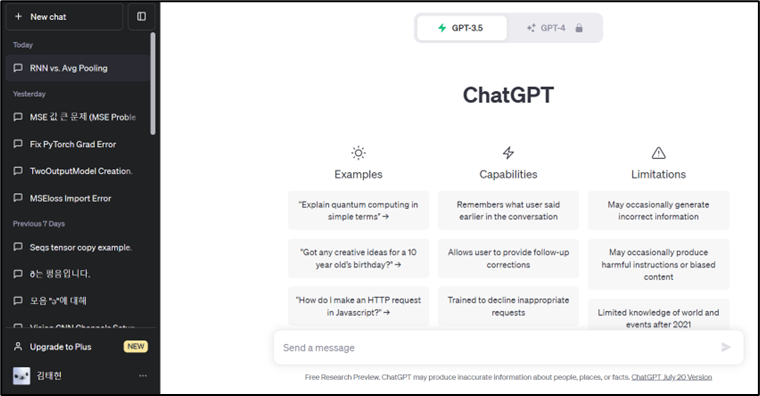

# FP32 LLM 대비 1-bit LLM의 효용성 분석 및 추론 시간 도출

---

## 목차

```jsx
0. 들어가며
1. LLM 이란?
2. 1-bit LLM 의 연산 과정은 왜 효율적인가?
3. n-bit LLM vs 1-bit LLM 성능 비교
4. 결론
```

---

# 들어가며

- 이 글에서 다룰 주제는 최근에 마이크로소프트가 공개한 **'1-bit LLM'** 이다.
- 최근 **기존 병렬 연산(16bit)으로 인하여 GPU 의 필요성**이 급격하게 높아지는 와중, 마이크로소프트가 **CPU 기반으로 1-bit LLM 추론**이 가능하도록 한 프로젝트를 지난 10월에 공개했다.
- 해당 프로젝트를 활용하면 1) 모델의 크기를 1/16 로 줄일 수 있다는 점, 2) 병렬 연산이 필요 없어져 CPU 로 GPU 를 대체하여 LLM 추론 시스템을 구축할 수 있다는 획기적인 장점이 있다.

  → **NVIDIA** vs **Intel … 엔비디아 GPU** 와 **인텔 CPU** 사이의 치고받는 대결이 계속되면서, 인공지능 시장 패러다임의 전환점이 될 수도 있는 이 시점에서 간단한 비유들과 몇 가지 실험 결과를 바탕으로 소개해보고자 한다.

---

# LLM 이란?

- 최근에 ChatGPT의 등장으로 AI 인공지능 시장이 화제가 되었었다. ChatGPT는 Chat + Generative + Pretrained + Transformer (대화형 + 생성형 + 사전학습한 + 예측 모델) 의 합성어이다.
    - Chat: 사용자와 자연어로 대화를 할 수 있는 기능
    - Generative: 데이터들을 단순히 분석하거나 분류하는 것이 아닌 새로운 텍스트를 ‘생성’하는 기능
    - Pretrained: 대규모의 데이터 셋을 통해 미리 학습되어 언어의 구조와 맥락을 파악
    - Transformer: Transformer 모델 구조 통해 텍스트 맥락을 이해하고, 단어 간의 관계를 파악
- 이러한 ChatGPT는 대규모 언어 모델이라고 한다. 대규모 언어 모델(LLM, Large Language Models)는 텍스트를 인식하고 생성하는 인공지능 AI 모델이다.
- LLM(Large Language Model)은 방대한 양의 텍스트 데이터를 학습하여 자연어(NLP)를 이해하고 생성할 수 있는 AI 모델입니다. 주로 딥러닝 기반의 신경망 아키텍처(Transformer)를 활용하며, 이를 통해 문장 생성, 번역, 텍스트 요약, 질문 응답과 같은 작업을 수행할 수 있다. [4]
- ChatGPT를 비롯하여 많은 LLM모델들이 등장하였다. 예로 들면, Google의 PaLM(Pathways Language Mode), Meta의 LLaMA (Large Language Model Meta AI), NVIDIA의 Megatron-Turing NLG)등이 있다.

---

## 1-bit LLM 의 연산 과정은 왜 효율적인가?

### 대략적인 LLM 작동 원리

- 대표적인 LLM 모델으로는 ChatGPT 가 있다. 최근에 GPT-4 를 넘어, GPT-4.5 까지 나와 사람들의 생활에 많은 도움을 주고 있다. 최근 ChatGPT 도 2018년도에 처음에 출시되어 지금까지 계속해서 발전해왔다.
    
    
    
- ChatGPT 의 작동방식은 매우 단순하다. 이렇듯, 간단하게 질문(ex. 너는 누구니?)을 입력하면 그에 대한 답(ex. 저는 ChatGPT 에요.)을 하는 것이 주요 메커니즘이라고 볼 수 있다. 텍스트 입력값에 대한 결과값이 나오는 단순한 메커니즘이다.
- 비유를 들자면, 사람에게 말을 시키면 고민하고 대답하는 것과 유사하다고 볼 수 있다. 여기서, 사람은 미국에 있는 ChatGPT 서버이고, 말은 나의 질문이고, 고민 후 대답하는 것을 LLM 모델이라고 생각하면 된다.
- 이번 글에서 다루고자 하는 것은 위 LLM 모델을 더욱 효율적으로 돌릴 수 있는 bitnet-cpp 에 대한 차별성의 이야기이다. 이를 이해하기 위해서는 기존 LLM 의 작동 원리를 가볍게 이해할 필요가 있어, 그 중 가장 이해하기 쉬울 수 있는 RNN 기반 LLM 모델에 대한 가벼운 내용을 다뤄보고자 한다.

### 32-bit LLM 작동 원리

- 기본적인 LLM 을 설명하기에 앞서서 대략적인 모델의 학습 메커니즘에 대하여 잠깐 짚어보고 가고자 한다. 그 중에서 시계열 데이터를 바탕으로 학습을 하는 RNN 모델에 대하여 설명을 해보겠다.

- RNN 모델이란?
    
    
    
    - 시계열 데이터에 대하여, 순서쌍에 대한 정보를 바탕으로 학습을 수행하는 모델이다.  x0, x1, x2, x3, … 순서대로 문자가 들어가고, 각 결과 값(h=hidden states)을 내놓는다.
    - 예로 들면, 아까 예시로 들었던, “너는 누구니?” 에 대하여, ‘너’ + ‘는’ + ‘ ‘ + ‘누’ + ‘구’ + ‘니’ + ‘?’ 의 순서로 모델의 값이 들어가게 된다. 모델은 각 입력에 대하여 확률 값을 제시한다. 이 말이 무엇인지 더 세세하게 설명하겠다.
    
    
    
    - 그렇다면 모델에 값이 들어가게 되면, 해당 모델에서 내놓는 h 값은 대체 무슨 역할을 하는 것일까? 결론부터 얘기하면, 모델의 각 단계 별 출력 값은 입력 값에 대한 다음 출력 결과를 예측하는 역할을 한다. [1]
    - 가벼운 예시로 들어보겠다.
        - 동네에 어떤 할아버지가 있는데 그 사람은 계속해서 “I am happy!”라고 말하는 긍정적인 할아버지로 유명하다. 동네 사람들의 소문을 들었을 때, “I am sad!”라고 들은 사람은 10명 중 1명도 되지 않았다.
        - 그랬을 때, 할아버지가 “I am …” 이라고 말하다가 멈췄다. 그렇다면 그 다음 단어를 뭐라고 예측할 수 있을 것인가? 분명히, “happy”라고 말할 가능성이 90%보다 높을 것이다. 그러면 가볍게 “happy” 는 0.9, “sad” 는 0.1 라고 확률값을 설정할 수 있을 것이다.
        - 이런 식으로 다음 단어를 예측하는 사고 방식을 RNN 모델이라고 생각하면 되고, “happy” 와 “sad” 와 같은 경우의 수를 단어 사전이라고 말한다. 또한, 이를 확률로서 나타내는 기술을 word embedding 이라고 한다.
        
- 모델 추론에 대한 병렬 연산 발생
    - 위 RNN 모델에 대해서 연산하는 과정을 보여주면서 병렬 연산이 발생하는 사례를 보여주도록 하겠다.
    
    
    
    - 위와 같이, 결과 값 Y 를 계산하는 과정에는 이전 W, h 값과 b 값이 필요하다. 여기서 W 과 h 에 대한 합성곱이 발생하게 된다. (RNN 에 대한 설명보단 1-bit 계산 방식에 대한 내용이므로 단순하게 다루겠다.)
    - 행렬곱 예시 [2]
        - 행렬 곱을 시각화하는 사이트를 기반으로 하여 행렬곱의 순서대로 표현해보고자 한다.
        - 여기서 파란 색깔로 연산되는 횟수를 세어보자.
        
        - (1) 0회
            
            
            
        - (2) 0회
            
            
            
        - (3) 2회
            
            
            
        - (4) 4회
            
            
            
        - (5) 2회
            
            
            
        - (6) 0회
            
            
            
        - 위 (1) ~ (6) 에 대한 연산 횟수를 세어보면 **총 8회**가 나온다.
        - 반대로 한 줄로 된 행렬끼리의 곱은 연산 횟수가 하나의 행렬에 대한 숫자 개수만큼 나오기 때문에, 직렬연산으로는 연산 횟수가 **4회**가 나오고 병렬 연산보다 4번이나 연산 횟수가 줄어든다.
    - 위 예시와 같이, 2X2행렬과 2X2 행렬에 대한 곱셈은 위처럼, 상당히 많은 병렬 연산을 요구한다. (4)번째 연산만 보더라도 두 행렬의 모든 값을 병렬로 접근하여 계산해야 한다.
    - 실제로, 위와 같은 병렬 연산은 GPU 에서는 유리하지만, CPU 에서는 상당히 불리한 방식이다. 그렇기에 GPU 의 수요로 NVIDIA 의 위상이 높아졌음을 보면 알 것이다.

- LLM 모델 추론 성공
    - 이렇듯, 가벼운 RNN 의 예시를 바탕으로 병렬 연산의 발생 가능성과 직렬 연산 적용 시 효율성이 비교적 개선되는 예시를 보여주었다.
    - 다음으로는, 이러한 기존 병렬 연산의 비효율성을 줄이기 위한 방법(ex. FP32, FP16, FP8, 1-bit)들이 나오게 되는데 그에 대한 내용을 보고자 한다.

---

# FP32, FP16, FP8

### FP32

- FP(Floating-point),FP32는 Single Precision이라고 한다. 일반적으로 모델 학습에 사용되는 부동 소수점 형식이다. 최근 연구들에서 모델 사이즈가 점점 커지면서 계산량과 필요한 메모리의 크기가 기하급수적으로 커지는 것을 확인할 수 있다. 큰 데이터들을  학습시키기 위해서 많은 리소스가 필요해지며 학습도 오래걸리는 현상이 발생했다. 이러한 문제점을 해결하기 위해서 Half-precision(FP16)을 사용하여 계산량과 메모리 사용량을 줄이는 방안이 제시되었다.

### FP16 [5]


FP16의 형식

$$
Value = (-1)^{Sign}\times 2^{Exponent-Bias}\times(1+Fraction)
$$

- FP16는 Half-precision이라고 하며, 16비트 부동 소수점 형식을 나타낸다. 그러나, 16비트의 정밀도가 낮아서 모델의 정확도는 떨어질 수 있다.
    - 부호 비트(Sign bit): 1비트 (양/음수를 결정)
    - 지수(Exponent): 5비트 (수의 범위를 결정)
    - 가수(Fraction): 10비트 (수의 정밀도를 결정)
- FP16은 FP32에 비해 데이터의 양이 절반으로 줄어들기 때문에 GPU나 TPU에서 메모리 대역폭 사용을 최적화하여 더 많은 데이터를 동시에 계산할 수 있도록 한다.
    
    
    |  | FP32 | FP16 |
    | --- | --- | --- |
    | 최대값 | 3.4×10^38 | 1.11×2^15 |
    | 최소값 | 2^(-149) | 2^-24 |

### Mixed-Precision Training [6]


- 기존의 FP32으로 작동되던 코드들을 FP16으로 변환하게 되었을 때 training loss가 중간에 크게 증가하는 모습을 볼 수 있다. 그 이유로 역전파 과정에서 기울기 (Gradient)들을 계산하고 축적하여 가중치 값을 업데이트하는데, FP16을 사용하게 되면 표현할 수 있는 수의 범위가 적어지고 오차가 발생하고, 오차가 누적되면서 학습이 제대로 되지 않는 모습을 볼 수 있다. 이 점을 해결하기 위해 학습과정에서 FP32와 FP16을 모두 사용하는 Mix-precision이 제안되었다.


- Master-Weights를 FP32 에서 FP16으로 변환한 뒤 정상파(Forward propagation)과 역전파(Backward propagation)은 모두 FP16으로 연산이 수행된다. 이후 가중치 값을 업데이트하는 과정에서 다시 FP32로 변환되어 가중치 값이 업데이트된다.
    
    
    
- FP16을 통한 학습 중 일부의 과정에서 FP16의 최소 범위인 2^24보다 적게 되어 0으로 반환되는 상황이 발생하는 경우가 종종 있었다고 한다. 작은 gradient값들을 모두 살리는 것보다 2^-27 ~ 2^-24 범위의 gradient만 살릴 수 있는 값들을 곱해서 loss가 커지는 문제를 해결했다고 한다.

### FP8 [7]

- 딥러닝에서는 반드시 정밀도가 높은 데이터 타입이 아니더라도 학습 성능에 크게 영향을 주지 않는 다는 사실이 밝혀지면서 이 논리를 극대화 시키기 위해 FP8이 제안되었다. 이는 학습능력에 크게 영향을 미치지 않으면서도 연산 효율성을 극대화한다.


- FP8에는 두 가지 인코딩 방식이 존재한다. 본 논문에서는 가중치 및 활성화에 대해서는 E4M3를, 기울기에 대해서는 E5M2를 사용하는 것을 권장한다.


- 기존의 소수점 인코딩 방식과 FP8을 사용했을 때의 성능 차이가 크게 없는 것을 확인할 수 있다. 따라서 딥러닝에서 처리하는 비트 수가 감소, 즉 정밀도가 감소해도 학습능력에 크게 영향을 끼치지 않는 것을 보여준다.


- 주요 동기는 딥러닝 훈련 및 추론의 가속화로, 메모리 대역폭 압박을 줄이면서 더 작고 전력 효율적인 수학 파이프라인을 가능하게 한다.
- 실제로, 이미지 및 언어 작업을 위한 다양한 신경망 모델을 FP8에서 훈련하여 동일한 모델, 최적화 도구 및 훈련 하이퍼파라미터를 사용하여 16비트 훈련 세션에서 달성된 모델 정확도와 일치시킬 수 있다.

---

# 1-bit LLM

- 기존의 FP32, FP16과 같은 데이터 형식은 파라미터 1개당 32비트, 16비트를 사용한다. 비트 수가 증가하면 숫자를 훨씬 자세하게 표현할 수 있다. 그러나 비트 수가 많다는 것은 계산량과 메모리 사용량 또한 많다는 것을 의미한다.

### 1-bit LLM 작동원리


- FP16 방식은 16비트의 실수를 표현해야하므로 복잡한 행렬연산은 필수적이다.
그러나 1비트로 표현을 하게 되면 숫자는 $\{-1,0,1\}$로만 표현이 되며, 이 숫자들로 행렬곱을 진행하게 되면 실제로는 곱셈이 아닌 덧셈과 뺄셈으로만 이루어진다. [8]
- 값들을 $\{-1,0,1\}$로만 표현하기 위해서는 **quantization** 이 필요하다.


- $\gamma$ 는 모든 요소들의  절댓값을 모두 더한 후 개수 만큼나눈 값이다. 즉 가중치의 평균 절대값을 계산하여, 가중치를 정규화하는데 사용되는 스케일링 값을 제공한다.
- RoundClip(x)는 x의 값을 round 는 소수점 첫째 자리에서 반올림하면서 정수가 되도록 만든 후 1 과 비교하여 작은 값을, 이후 -1과 비교하여 큰 값을 출력하도록 하는 함수이다.
- $W$는 $γ+ϵ$로 나누어 RoundClip함수에 대입하여 **quatization**시킨다.
- $\{-1,0,1\}$로 표현이 되므로 $W⋅X$는 $XOR(W,X)$로 표현될 수 있어서 연산속도가 매우 빨라지며 모든 결과 값을 누젹하여 최종 출력을 계산한다. [9]
- 이 과정에서 더 적은 비트로 표현되어 메모리 사용량 및 계산 속도가 빨라진다.  (아래 Perplexity 비교 Chapter 에서 자세히 다룰 예정)
- 논문에서 비슷한 파라미터들로 실험을 수행한 결과 성능은 비슷하거나 더 높은 것을 확인할 수 있다.

### 1 -bit LLM의 parameter 별 성능 차이


- 모델의 세부 parameter들의 크기를 키우면서 모델의 latency와 memory 사용량을 측정한 결과, 모델의 크기가 커질 수록 격차가 점점 심해지는 것을 보여주며, 본 논문에서는 앞으로 모델 거대화에 있어서 더욱 효과적일 것이라고 실험적으로 보여주며 주장하고 있다. [10]

---

# Perplexity 비교

### Perplexity 정의

- 텍스트 생성 언어모델의 성능 평가지표 중 하나이다.
- 언어 모델의 분기계수(Branching Factor)라고도 한다.
- 이전 단어로 다음 단어를 예측할때 “**몇개의 단어 후보를 고려”하는지** 의미한다.
- Perplexity값이 낮을수록 성능이 우수하다. [11]

### Perplexity 비교 : FP16 LLaMA VS 1Bit LLM

- 비교대상 : FP16 LLaMA → 기존 LLM에서 파라미터를 표현하는 방식이다.
- FP16 : 16비트로 구성된 부동소수점(floating-point)으로 **파라미터를 표현하는 방식이다.**

### Perplexity 정의

- 텍스트 생성 언어모델의 성능 평가지표 중 하나이다.
- 언어 모델의 분기계수(Branching Factor)라고도 한다.
- 이전 단어로 다음 단어를 예측할때 “**몇개의 단어 후보를 고려”하는지** 의미한다.
- Perplexity값이 낮을수록 성능이 우수하다. [11]


- **위는 Memory (GB), Latency(ms), Perplexity(PPL)를 비교한 표이다. [12]**
- **메모리(GB)**: BitNet b1.58는 FP16 LLaMA 대비 메모리 사용량이 **2.6배~3.55배 감소했다.**
- **지연 시간(Latency)**: BitNet b1.58는 FP16 LLaMA 대비 **1.23배~2.71배 빠르다.**
- **Perplexity(PPL)**: 성능 손실은 최소화되었으며, 특히 **3B 모델(9.91)** 및 **3.9B 모델(9.62)**에서 LLaMA보다 낮은 PPL 값을 보인다.


- **위는 Zero-shot(모델이 학습 과정에서 배우지 않은 작업을 수행하는 것)을 비교한 표이다.**
- **3B 모델 크기** 이상에서는
    - BitNet b1.58이 **FP16 LLaMA와 유사하거나 더 나은 성능**을 보인다.
    - 특히 **ARCc(28.7)**, **HS(44.2)**, **PQ(73.2)** 등의 과제에서 두드러진 성능 향상을 기록했다.

### 결론

- Perplexity와 Zero-shot 정확도 모두에서 BitNet b1.58은 **LLaMA와 경쟁력 있는 성능이다.**
- 특히 3B 이상 모델에서 FP16 LLaMA를 능가하거나 동등한 성능을 내고 있다.

---

# 추론 시간(inference response time) 비교


### 과정

- 허깅 페이스 LLM 추론 사이트,  MS의 오픈소스를 활용했다.
- 1bit LLM과 32bit LLM의 토큰 별 추론 시간을 비교한다.
- 10,20,50,100,200,500,1000 토큰 별 10회 추론 진행 후 **평균 추론 시간을 도출 및 대조 과정을 진행한다.**

```java
10 Tokens
"What are the basic concepts of artificial intelligence?"
"Why is climate change a critical issue today?"

50 Tokens
"Concerns about climate change have grown worldwide. Why have people become more sensitive to environmental issues, and what are the key drivers of this awareness?"
"What were the main causes of the fall of the Roman Empire, and how did this historical event impact European society?"

100 Tokens
"Machine learning and artificial intelligence are transforming the technology industry, bringing major changes across various sectors. In particular, advances in machine learning algorithms are enhancing automation potential and providing new insights in data analytics. What are the current main challenges faced by machine learning, and what research or technological approaches are being developed to address them?"
"Ancient Egypt is renowned for its impressive architecture, including the iconic pyramids. This civilization thrived for centuries, accumulating extensive knowledge and technological advancements. What unique characteristics distinguished ancient Egypt from other civilizations of the time? Additionally, how has Egyptian architecture influenced modern society?"

200 Tokens
"Climate change is a global issue that impacts not only industry and economy but also society at large. Many countries have implemented policies to reduce greenhouse gas emissions, and individuals are increasingly adopting eco-friendly practices in their daily lives. For instance, there has been a rise in electric vehicle usage and energy-efficient appliances. However, how effective are these measures? Why is it important for industries and individuals to work together in this effort? Furthermore, what specific areas require cooperation between governments and corporations to tackle this complex challenge effectively?"
"In recent years, advancements in artificial intelligence have brought innovation to multiple fields, especially in healthcare, finance, and manufacturing. AI, combined with big data, opens up new avenues for solving complex problems. As the technology evolves, what ethical considerations should guide AI development? How can we ensure AI applications benefit society while avoiding potential risks? Discuss both the promise and the challenges AI presents as it becomes more deeply integrated into our daily lives."

500 Tokens
"Climate change is one of the most serious challenges facing modern society, primarily driven by greenhouse gas emissions from human activities. Since industrialization, many nations have relied on fossil fuels like coal and oil to power their economies, resulting in rising global temperatures that negatively impact ecosystems and biodiversity. Can you discuss the specific impacts of climate change on ecosystems and human health in different regions? Additionally, what policies and agreements are currently in place internationally to mitigate climate change, and how effective are they? What improvements are necessary to ensure these measures have a meaningful impact? Lastly, what are some practical ways that governments and individuals can contribute to combating climate change? Furthermore, could you explore how educational programs and campaigns might help raise public awareness about climate change, fostering greater understanding and proactive responses to this issue?"
"Recent advancements in artificial intelligence (AI) have revolutionized various industries, particularly in healthcare, where AI is being increasingly applied to diagnostics, treatment planning, and patient management, improving diagnostic accuracy and treatment efficiency. For example, machine learning algorithms are being used to enhance cancer diagnosis through image analysis. However, the rapid development of AI in healthcare raises ethical and legal concerns, especially regarding the potential risks to patients if AI systems are improperly implemented. Can you discuss the positive impacts and ethical challenges of AI in healthcare? What regulatory frameworks or guidelines should be established to ensure AI is used safely and effectively in medical contexts? Furthermore, how can governments, academia, and healthcare institutions collaborate to address these challenges, ensuring responsible development and application of healthcare AI?"

1000 Tokens
"Artificial intelligence (AI) and machine learning (ML) have driven transformative changes across many sectors in recent years, significantly impacting industries like healthcare, where AI-powered diagnostic tools and personalized treatment programs are being developed based on patient data. These AI-based tools enhance diagnostic accuracy and treatment efficiency while supporting healthcare professionals in providing higher quality care. However, there are several critical ethical and legal issues associated with this technology’s advancement. For instance, if the decision-making processes of AI diagnostic algorithms lack transparency, it may be difficult for healthcare professionals and patients to trust these tools, potentially leading to misdiagnoses. Additionally, there are concerns regarding patient privacy and data usage, as well as the risk of malicious data breaches or misuse. What are the main ethical and legal challenges posed by AI applications in healthcare? What regulations or guidelines would be necessary to address these issues effectively? Furthermore, what roles should governments, healthcare institutions, and tech companies play in ensuring the safe and ethical use of AI in healthcare? Discuss potential frameworks for enhancing data security and informed patient consent, and provide examples of strengthened protocols that might ensure safe use of AI in medical settings. While AI offers considerable potential for improving healthcare systems, careful oversight and ethical consideration are crucial. How can AI gain public trust and continue to drive healthcare innovation responsibly? Finally, could you discuss how international collaboration may play a role in establishing global standards? Additionally, how might healthcare professionals and patients work together in the development process to foster safety and reliability in AI-based healthcare tools? Lastly, what policy and social considerations would help ensure the widespread benefits of these AI-driven healthcare solutions?"
"Globally, climate change is having profound impacts on the economy and society at large, prompting countries worldwide to implement various policies to address it. Climate change accelerates global warming, leading to severe consequences like ecosystem destruction, rising sea levels, and increased extreme weather events. This complex, multi-faceted issue requires urgent attention and coordinated efforts to mitigate its effects. Could you elaborate on the economic, environmental, and social impacts of climate change, focusing on different regions’ unique challenges? Additionally, discuss the international policies and agreements currently in place, such as the Paris Agreement, and evaluate their effectiveness. What are the primary obstacles these measures face, and how might they be strengthened to achieve substantial progress? Furthermore, what are some actionable steps that individuals, local communities, and governments can take to mitigate climate change? Discuss the importance of public awareness and education programs in fostering a global understanding of climate change. Finally, consider how cross-sector collaboration—between governments, corporations, and environmental organizations—could help achieve meaningful, long-term solutions to this global crisis."
```

- 허깅 페이스에서 제공하는 LLM 추론 시간 측정 오픈소스
    - https://huggingface.co/spaces/medmekk/BitNet.cpp/tree/main

- MS에서 제공하는 BitNet1.58모델 오픈소스
    - https://github.com/microsoft/BitNet.git

### 코드 실행 결과


- 결과 엑셀 파일
    
    [inference_time_comparison.xlsx](inference_time_comparison.xlsx)
    

- 실제 결과 대조 plot


- 1bit LLM의 평균 추론 시간이 32bit LLM 대비 2 ~ 5배 더 빠르다.
- 토큰 값이 커질수록 차이가 극명하게 나타난다.

---

## 결론 (1-bit LLM 의의 및 마무리)

- 기존 병렬 연산이 주가 되는 AI 모델에 대하여 **1-bit LLM 기술**을 적용한 후 기존 성능을 유지하면서도, **1) 모델의 크기(파라미터)가 줄어들었으며, 2) 추론 시간의 효율성** 또한 높아졌다.
- 그럼에도 불구하고, 지금은 순서대로 값을 집어넣는 것이 아닌, 사진과 같이 2차원적인 성격이 섞여 있는 상황에서는 1-bit 로 줄어드는 과정 중 정보 손실이 일어날 수 있다. 이러한 부분은 개선해야 할 방향이라고 보여진다. 이러한 필요성이 대두되는 상황 중 4-bit 활성화 함수에 대한 연구도 최근 활발하게 이뤄지는 것으로 확인되었다. [3]
- 이렇듯, 모델의 크기를 줄어드는 부분을 토대로 GPU 를 CPU 로 대체할 가능성 또한 확인할 수 있었다. 이런 기술의 발전은 청소기나 데스크탑 등 개인 소유 기기에 AI 기능을 탑재하는 기술인 온디바이스 AI 의 발전을 기대해볼 수 있다고 본다.
- 위 사례와 같이 연구 가치가 있는 기술이라고 생각하며, 앞으로의 **1-bit LLM 기술**의 연구에 관심을 가졌으면 하는 말을 마지막으로 글을 마치고자 한다.

---

# 출처

[1] [https://m.blog.naver.com/wooy0ng/222611230509](https://m.blog.naver.com/wooy0ng/222611230509)

[2] [https://matrixmultiplication.xyz/](https://matrixmultiplication.xyz/)

[3] [https://arxiv.org/abs/2411.04965](https://arxiv.org/abs/2411.04965)

[4] [https://aws.amazon.com/ko/what-is/large-language-model/](https://aws.amazon.com/ko/what-is/large-language-model/)

[5] [https://en.wikipedia.org/wiki/Half-precision_floating-point_format](https://en.wikipedia.org/wiki/Half-precision_floating-point_format)

[6] [https://developer.nvidia.com/blog/mixed-precision-training-deep-neural-networks/](https://developer.nvidia.com/blog/mixed-precision-training-deep-neural-networks/)

[7] [https://arxiv.org/abs/2209.05433](https://arxiv.org/abs/2209.05433)

[8] [https://arxiv.org/abs/2310.11453](https://arxiv.org/abs/2310.11453)

[9] [https://huggingface.co/papers/2402.17764](https://huggingface.co/papers/2402.17764)

[10] [https://heygeronimo.tistory.com/94](https://heygeronimo.tistory.com/94)

[11] [https://heytech.tistory.com/344](https://heytech.tistory.com/344)

[12] [The Era of 1-bit LLMs: All Large Language Models are in 1.58 Bits](https://arxiv.org/pdf/2402.17764v1)